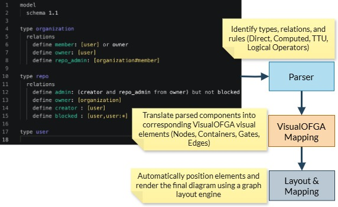
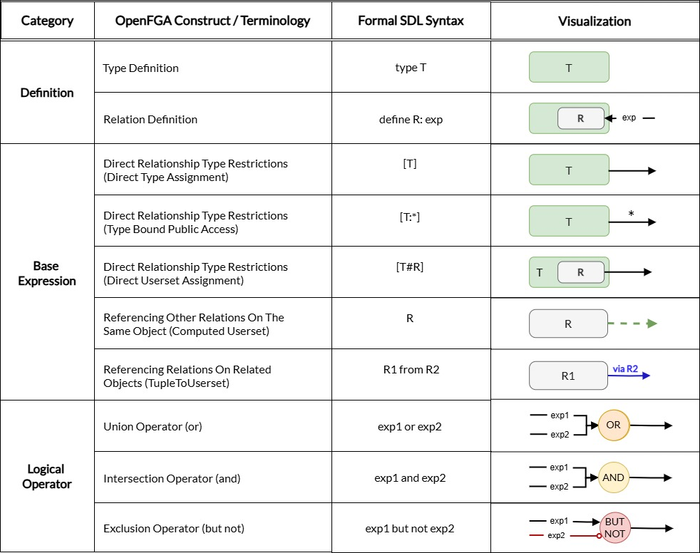
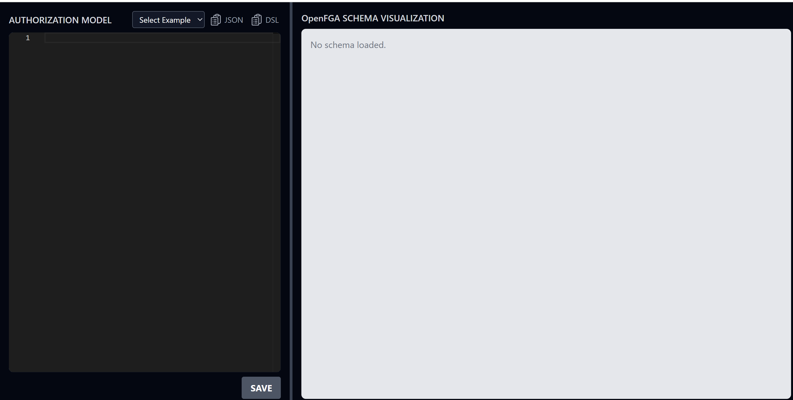
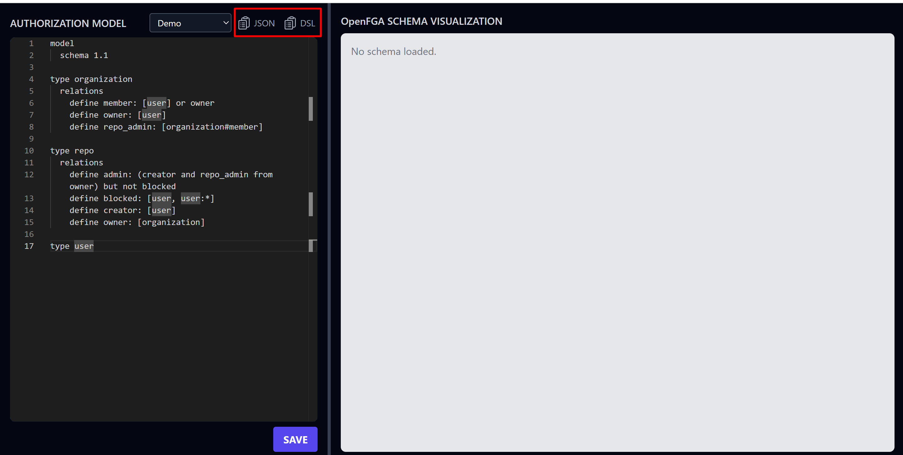
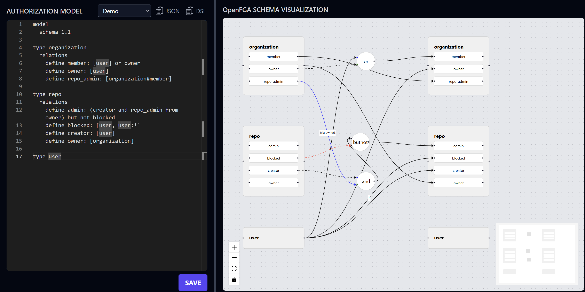

# VisualOFGA: Visualizing Open Fine-Grained Authorization Policies

---

## 🧠 Introduction

[OpenFGA](https://openfga.dev/) is a scalable, open-source engine for **relationship-based access control (ReBAC)**. It allows developers to define authorization policies using a declarative Domain-Specific Language (DSL) or JSON.

While powerful, OpenFGA’s textual schemas are often too complex for non-developer users to understand, audit, or modify. Current visualization tools only support static previews or query-based paths, offering limited utility for broader schema interpretation.

**VisualOFGA** bridges this usability gap through an **interactive graph-based visualization** of OpenFGA schemas, enabling:
- Schema interpretability via visual graphs
- Visual editing with round-trip DSL/JSON conversion
- Representation of logical composition, delegation, and inheritance

---

## 📊 Methodology

We designed a pipeline to convert OpenFGA schemas into a graph structures:

---

## 📈 Analysis

The core focus of our analysis is the transformation of OpenFGA schemas into **interactive graph components**. Each visualized schema reveals:

- **Types and relations** as node groups and connectors
- **Logical composition** (AND, OR, NOT) as labeled intermediate nodes
- **Delegation flows** using special edges (e.g., `from` keyword)
- **Access inference paths** traced visually across linked nodes

This structure enables **users to directly interpret the access logic**, even in complex delegation chains.

---

## ✅ Results/Current Progress

We have successfully developed the first version of the VisualOFGA project with the following key accomplishments:

1. **Implemented OpenFGA Playground parser** to process JSON and DSL schemas.
2. **Developed graph visualizations using nodes and edges**, with distinct edge styles representing different types of relationships between nodes.
3. **Enabled copying of JSON and DSL files**, allowing round-trip conversion between text and visual representations.

---

## 📸 Snapshots

The following snapshots illustrate key stages of the VisualOFGA interface in action:

### 🟤 Initial Interface

> The user is presented with a dual-pane interface—on the left is the DSL editor, and on the right is the visual schema panel.

---

### ✍️ DSL Input Loaded

> An OpenFGA DSL schema is entered into the editor. The "Save" button triggers parsing and graph rendering. The schema can be copied in either JSON or DSL format for reuse or integration.

---

### 🧮 Visualized Schema Graph

> The schema is transformed into a visual graph with distinct nodes and edge types representing relation logic. This includes logical constructs like `and`, `or`, `but not`, and cross-type references.

## 🧪 Future Work

The VisualOFGA system lays the groundwork for more advanced OpenFGA schema visualization and tooling. Future directions include:

1. **Dynamic Alignment Enhancements**  
   Implement improved layout strategies to dynamically align nodes and edges.
2. **Interactive Visual Editing**  
   Enable direct manipulation of the graph—such as repositioning nodes, adding nodes and edges, editing relations, or modifying logic—allowing users to edit schemas visually.
3. **Schema and Tuple Graph Integration**  
   Integrate schema diagrams with tuple instance data, enabling users to explore both the schema and its applied relationships. This dual-view model supports analysis of how theoretical definitions map to real-world access relationships.

4. **Query Dependency Path Tracing**  
   Add support for visualizing how specific authorization queries propagate through the schema and tuple graph. This will help users trace decision-making logic based on relationships and policy logic.

5. **Schema Evolution and Impact Analysis**  
   Introduce “what-if” simulation tools that help users understand the effect of schema modifications over time. Features may include side-by-side schema diffs, simulated query results, and backward compatibility checks.

---

## 📚 References

1. [Relationship-based Access Control: Protection Model and Policy Language](https://dl-acm-org.libproxy.albany.edu/doi/abs/10.1145/1943513.1943539)  
   Philip W. L. Fong. *Proceedings of the First ACM Conference on Data and Application Security and Privacy (CODASPY)*, 2011.

2. [Zanzibar: Google’s Consistent, Global Authorization System](https://www.usenix.org/conference/atc19/presentation/pang)  
   Ruoming Pang et al. *2019 USENIX Annual Technical Conference (USENIX ATC 19)*, pp. 33–46, 2019.

3. [OpenFGA](https://openfga.dev/)  
   The Linux Foundation contributors. Accessed April 15, 2025.

---

